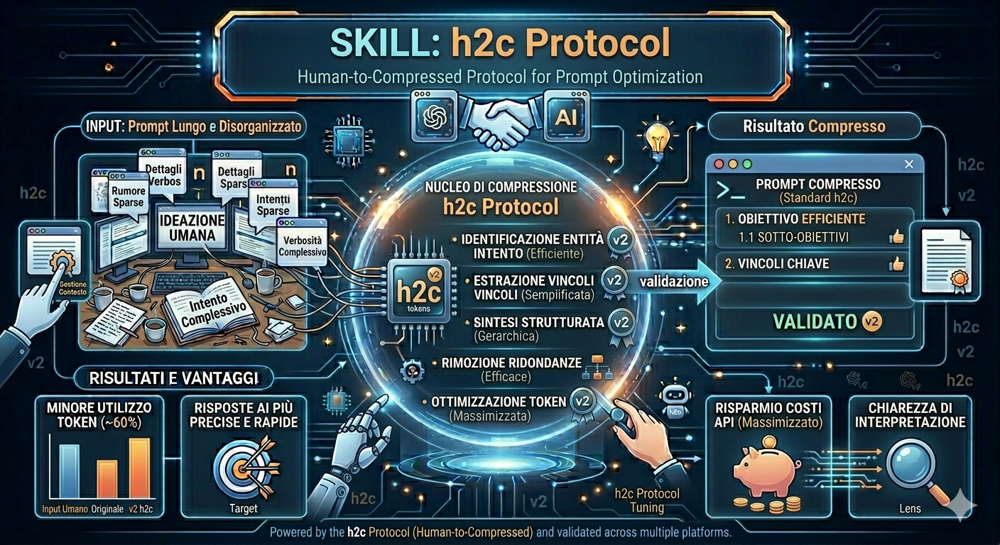

# h2c Protocol (Human-to-Compressed)

**Protocollo aperto per dialogo AI-to-AI a token minimi.**
Grammatica a blocchi compressi, autodescrittiva, zero-shot, cross-model.

Licenza: MIT

---

## Perché h2c

Gli LLM comunicano in linguaggio naturale. Per un umano va bene. Per un agente automatico no:

- Un piano architetturale: 500-2000 token
- Un ciclo build-test-fix: migliaia di token
- Una catena di 3 agenti: decine di migliaia di token
- La maggior parte sono spiegazioni, cortesie, markdown, ridondanze

**h2c taglia fino al 90%** sostituendo il linguaggio naturale con una grammatica a blocchi densi.

| | Linguaggio naturale | h2c Protocol |
|---|---|---|
| Piano architetturale | ~800 token | ~50 token |
| Esito build | ~200 token | ~15 token |
| Ciclo completo 3 agenti | ~5000 token | ~200 token |
| Cross-model | Richiede riadattamento prompt | Autodescrittivo |

---

## Come funziona

Ogni messaggio è un blocco:

[TIPO:Azione]
campo1:valore1|campo2:valore2|...

Niente altro. Zero spiegazioni, zero markdown, zero testo libero.

### Blocchi principali

| Blocco | Scopo |
|---|---|
| `[ARCH:PLAN]` | Piano architetturale da prompt umano |
| `[BUILD:EXEC]` | Richiesta implementazione |
| `[BUILD:DONE]` | Implementazione completata |
| `[BUILD:FIX]` | Richiesta correzione |
| `[TEST:RUN]` | Richiesta test |
| `[TEST:PASS]` | Test superato |
| `[TEST:FAIL]` | Test fallito |
| `[CTX:PRIMITIVES]` | Snapshot stato conversazione |
| `[STATE:FINDINGS]` | Risultati analisi |
| `[ORCH:END]` | Chiusura ciclo |
| `[SKILL:PROMPT]` | Definizione agente specializzato |
| `[CTX:PRUNE]` | Pulizia entità attive ogni 5 msg |
| `[CTX:COMPACT]` | Compattazione storia cumulativa ogni 20 msg |
| `[CTX:FREEZE]` | Reset baseline archivio storia (~100 msg) |

### Flusso tipico

Prompt umano → [h2c] → [ARCH:PLAN] → [BUILD] → [TEST] → Done
↑ ↓
└── [BUILD:FIX] ←── Fail

---

## Esempi

 [Api meteo](examples/api-meteo.md)

 L'h2c utilizza circa il **35%** dei token rispetto al prompt umano.   

[Todo console](examples/todo-console.md)

L'h2c utilizza circa il **41%** dei token rispetto al prompt umano.

[Usa questo file per fare un test in autonomia](Test.md)

---

## Test eseguiti

[Claud sonnet 4.6](Test-Sonnet4.6.md)

[Opus 4.7](opus4_7/REPORT.md)

## Skills

Ogni agente nella catena è definito da una skill markdown. Si copia come system prompt e l'agente opera nel formato h2c.

| Skill | File | Input | Output |
|---|---|---|---|
| **h2c v1.1** | `skills/h2c_v3.md` | Prompt umano | `[ARCH:PLAN]` |
| **orch** | `skills/orch_v1.md` | Blocchi agenti | Instradamento |
| **build** | `skills/build.md` | `[BUILD:EXEC]` | Codice + `[BUILD:DONE]` |
| **test** | `skills/test.md` | `[TEST:RUN]` | `[TEST:PASS/FAIL]` |
| `[CTX:PRUNE]` | Pulizia entità attive ogni 5 msg |
| `[CTX:COMPACT]` | Compattazione storia cumulativa ogni 20 msg |
---

## Vantaggi

- **Risparmio token stimato fino al 50%** rispetto a dialoghi naturali
- **Cross-model**: testato su modelli diversi, zero-shot, senza preamboli
- **Zero dipendenze**: solo formato testuale, nessuna libreria
- **Snapshottabile**: `[CTX:PRIMITIVES]` salva e ripristina lo stato conversazione
- **Autodescrittivo**: qualsiasi LLM capisce il formato senza istruzioni preliminari
- **Agent-first**: progettato per catene di agenti, non per umani
- **MIT**: usa, modifica, integra liberamente

---

## Iniziare in 30 secondi

1. **Copia** `skills/h2c_v3.md` come system prompt in una nuova chat
2. **Incolla** un prompt umano qualsiasi
3. **Ricevi** `[ARCH:PLAN]` pronto da passare a un builder

Per l'orchestrazione automatica: `skills/orch_v1.md`

---

## Specifica completa

Vedi [SPEC.md](SPEC.md) per la grammatica formale e tutti i blocchi.

---

## Stato del progetto

Protocollo in fase di validazione iniziale. Testato con successo su dialogo cross-model con quattro modelli (**gratuiti**) diversi . Benchmark e validazione formale in corso. Contributi e feedback benvenuti.

---

## Licenza

MIT — Copyright © 2026 **Paolino Salamone**.

